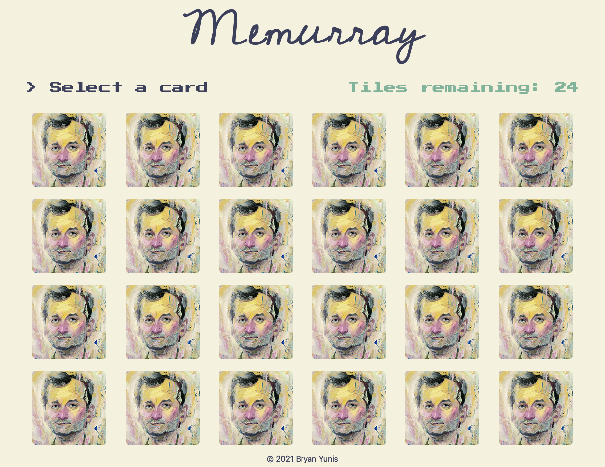
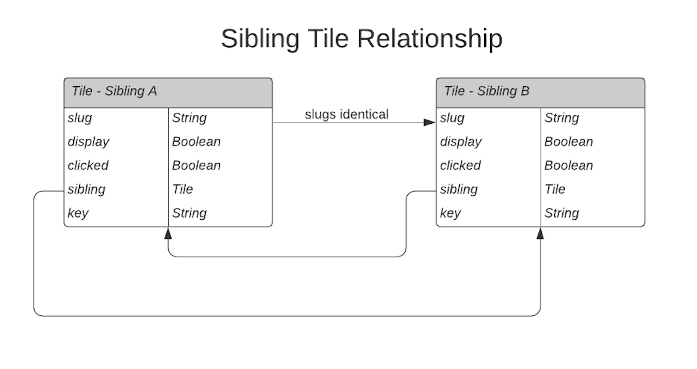

# Memurray

[](https://bryan.computer)

## [https://bryan.computer/](https://bryan.computer/)

## Description and gameplay

A Bill Murray themed Memory game written in Vue.js. Click a card to reveal the image underneath. Click another card to reveal its image. If the images are identical, those tiles are removed. Otherwise, they stay and the game continues. Remove all tiles to win!

## Documentation

### Running Locally

```sh
npm install
```

### Dev server

```sh
npm run serve
```

### Running tests

```sh
npm run test:unit
```

Note that this app uses the [Giphy API](https://developers.giphy.com/), so running locally requires an API key in the .env file which is not committed to this repo to protect its integrity. Please contact Bryan or request an API key and put it in an .env file with the name `VUE_APP_API_KEY` in order to run the app locally.

## Details

### The Grid

The core Memurray UI is represented by a `grid` that's comprised of an array of `tile` (card) items.

```ts
type Tile {
    slug: String,
    display: Boolean,
    clicked: Boolean,
    sibling: Tile,
    key: String
}

type Grid = Tile[]
```

Each tile has a reference to its sibling tile, which is the corresponding tile with identical slugs that must be the next selected tile in order to progress the game.

In the diagram below, two sibling tiles are displayed showing their relationship. They are both `Tile` types.



The grid's core functionality is contained in `/src/utils/grid.js`, which provides methods for building and shuffling the grid and modifying it to reflect changes in gameplay.

To build a grid, an array of unique `slug`s is provided to the `buildGrid` function. Each slug is then duplicated, associated with its duplicate, and added to the array to be returned. The other properties detailed in the `Tile` type are also added at this time. The game is currently built around the `slug` representing an image url, however a small change to the UI would allow words, numbers, or other abstractions to be used instead of images.

The grid utility makes extensive use of the [Ramda](https://ramdajs.com/) library, as array manipulation lends itself well to a functional programming paradigm.

## Game mechanics

When a tile is selected, it is revealed and a reference of it is saved in `MemoryGrid.vue` -- the main game logic component of the app. When the next tile is selected, its key is compared to the sibling key of the originally-selected tile. If they match, both tiles are hidden from view using the `display` option on the tile; if not, both turn back to face-down. In both cases, the selected tile is cleared and the user is notified.

Once all tiles are hidden (have `display: false`), the game is over and the user receives feedback.

`MemoryGridTile.vue` wraps each tile to provide different display states of the tile. `MemoryGridStatus` displays the tiles remaining and whether the last two cards chosen were "correct."

## Client

Memurray makes use of the [Giphy API](https://developers.giphy.com/) to get images on the bottom-face of the cards. In `/src/api/` an index file provides a base client, which could manage any app-wide configuration, helps build request URLs, and allows use of a particular client library for the request. In `giphyClient.js` the base client and giphy configuration are composed to produce a request method. `fetch` is used due to a minimal need of configuration for the giphy client.

## Style

The app is mainly styled with [Tailwind CSS](https://tailwindcss.com/). A `StyleProvider` wraps the app and provides some base styles. `src/assets/styles/appStyles.scss` provides application-wide style variables for ease in consistency.

## Next steps

* Customizable grid size. Since the giphy API is used to populate the tiles, an arbitrary grid size could easily be implemented. 24 is stored as a data property in `MemoryGrid.vue`, which is used to build the grid; simply changing this number would build a grid of a corresponding value. The CSS Grid properties might also need changing if the number is drastically different from 24

* Customizable theme. Despite its name, this app could easily accomodate different themes by changing the search query. Allowing user input to do so could make for an interesting modification, however validation would be required to ensure the game were playable with a given search term.

* Other ideas? Contact [Bryan Yunis](https://github.com/bry-an/)